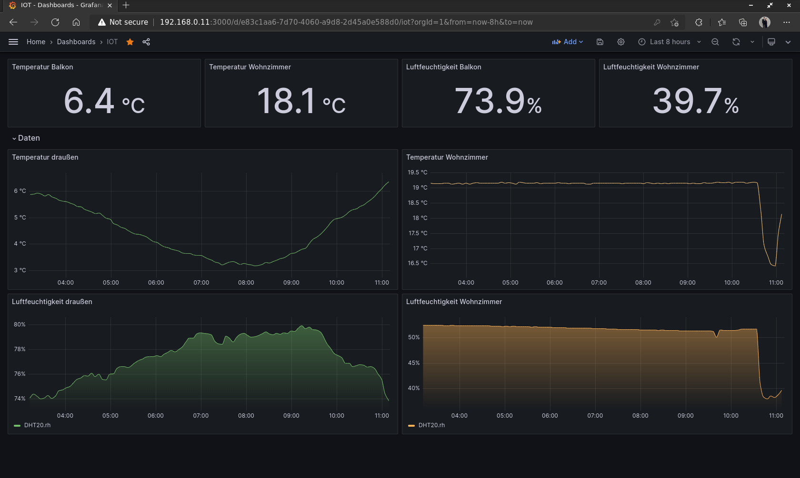

# Sensor Network

This project enables a home sensor network capable of measurement, transmission and storage of the data. A generic `IOT_Sensor` class class handles all communication tasks, with new sensors created as child classes to implement specific measurements. Currently the following sensors are supported: [DHT20](https://www.berrybase.de/dht20-digitaler-temperatur-und-luftfeuchtesensor) with `DHT20_IOT` and photoresistors with `Photoresistor`. The code is written in Micropython for the Raspberry Pi Pico and for the transmission MQTT is used. 
A central Raspberry Pi acts as an MQTT broker and saves the incoming data in an InfluxDB database. Thereby each measurement gets the name of the sensor (e.g. DHT20), as a tag the place of measurement and the different measurements as fields. To visualize the data in a interactive web interface grafana is used.

## Prepare the Raspberry Pi

1. Install InfluxDB v1.8 on the Raspberry
2. Create the database with: `CREATE DATABASE IOT_at_home`
3. Install the MQTT Broker *Mosquitto*
4. Install the MQTT client libary paho with `pip install paho-mqtt`
5. Run the Python file which saves incoming messages at the database `nohup python mqtt_to_influx.py &` 
6. Install grafana according to the instructions [here](https://grafana.com/docs/grafana/latest/setup-grafana/installation/)
7. Establish a connection between grafana and the database
8. Use *grafana.json* to create the final dashboard

## Prepare the Raspberry Pico(s)

1. Connect the DHT20 sensor with I2C on Pin 4: SDA, 5:SCL or the Photoresistor with the ADC on Pin 36 + 34.
2. Copy the lib file on the Pico. This files contains the [DHT20 Libary](https://github.com/flrrth/pico-dht20) for the I2C connection from GitHub and the *umqtt* package
3. Change the wifi credentials and enter the location of the temperature sensor (e.g. balkon)
4. Upload the file as *main.py* on the Pico -> now the file runs after the Pico is connected to electricity

## To add later
- add some logging for errors on the Picos
- add support for time-delayed sending of the measurements
